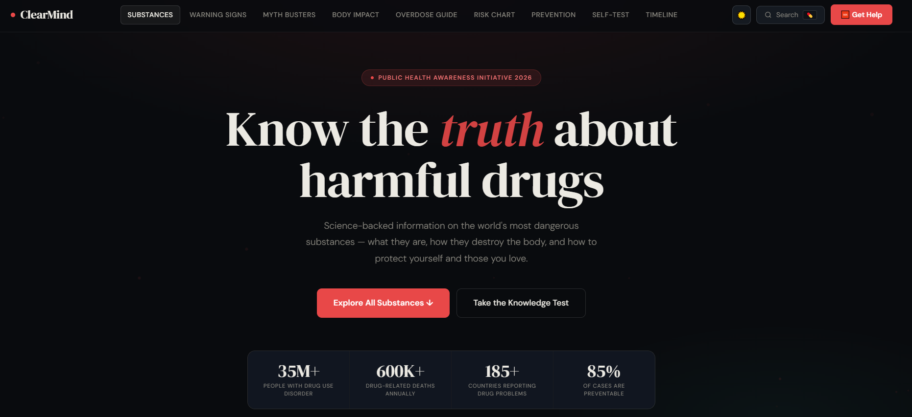
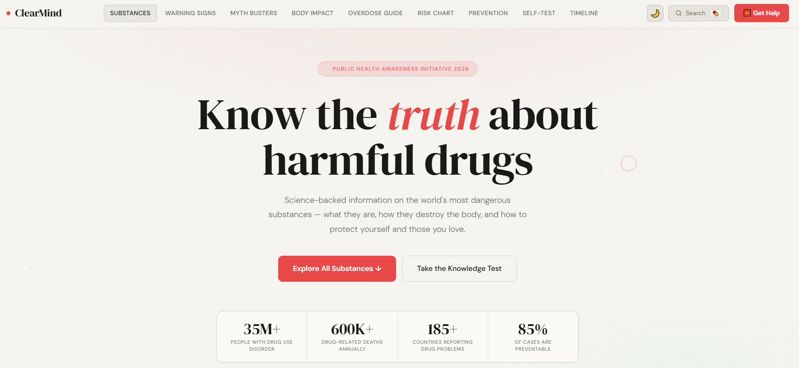
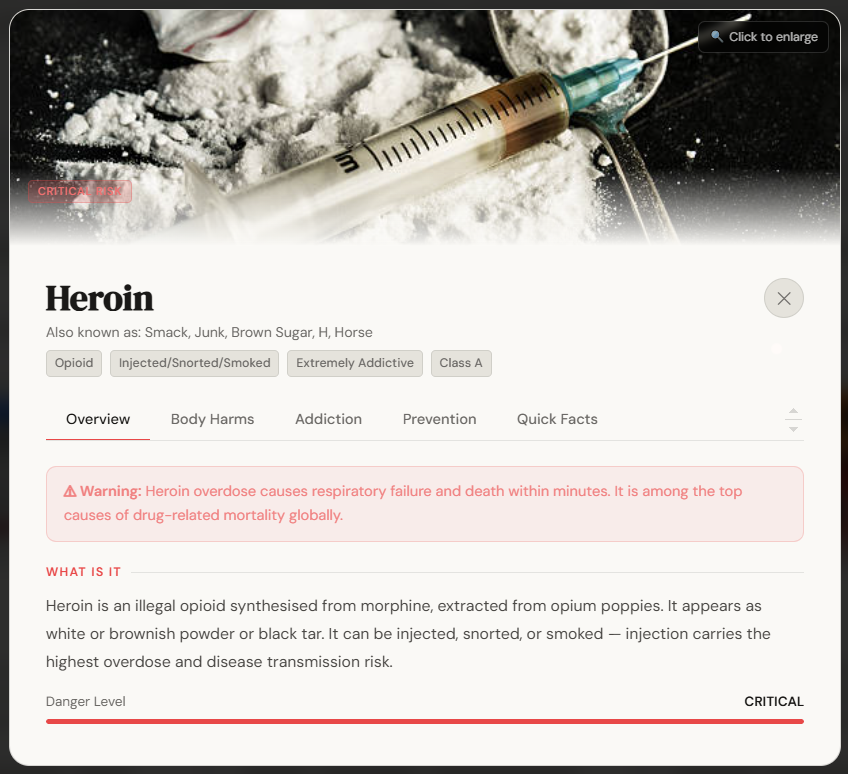

# 🧠 ClearMind — Drug Awareness & Prevention

> **A science-backed, single-file web app covering 25 of the world's most harmful substances — built for public health education.**


---

## 📋 Table of Contents

- [Overview](#-overview)
- [Live Demo](#-live-demo)
- [Features](#-features)
- [Sections](#-sections)
- [Tech Stack](#-tech-stack)
- [Getting Started](#-getting-started)
- [Project Structure](#-project-structure)
- [Customisation](#-customisation)
- [Screenshots](#-screenshots)
- [Contributing](#-contributing)
- [Guidelines](#-guidelines)
- [Disclaimer](#-disclaimer)
- [License](#-license)

---

## 🌍 Overview

**ClearMind** is a fully self-contained, zero-dependency public health awareness website covering 25 controlled and harmful substances. Every piece of information is science-backed and written with a single goal: to educate, not sensationalise.

The entire project ships as **one HTML file** — no build tools, no frameworks, no npm. Just open it in a browser.

Key statistics featured on the site:

| Stat | Figure |
|---|---|
| People with drug use disorder | 35M+ |
| Drug-related deaths annually | 600K+ |
| Countries reporting drug problems | 185+ |
| Cases that are preventable | 85% |

---

## 🚀 Live Demo

> Deploy to GitHub Pages in one click — see [Getting Started](#-getting-started).

```
https://shukdevtroy.github.io/ClearMind/
```

---

## ✨ Features

### 🗂️ Content
- **25 substance profiles** — each with overview, body harms, addiction science, prevention steps, and quick-reference facts
- **Drug category filters** — Opioids, Stimulants, Depressants, Hallucinogens, Cannabis, Inhalants
- **Grid & list view toggle** for the substances section

### 🖼️ UI & UX
- **Full-image lightbox** — click any drug photo inside its profile modal to view it fullscreen
- **Dark / Light mode** toggle with persistent preference
- **Custom animated cursor** with hover scaling
- **Scroll progress bar** across the top of the page
- **Smooth scroll navigation** with active section highlighting
- **Animated particle background**
- **Animated counters** triggered on scroll
- **Reveal-on-scroll** animations throughout
- **Responsive** — fully mobile-optimised with hamburger menu
- **Keyboard shortcuts** — `Ctrl/⌘ + K` to open search, `Esc` to close any overlay

### 🔍 Search
- **Live search overlay** (`Ctrl + K`) across all 25 substances
- Instant results with emoji, name, and description preview
- Click any result to jump directly to the full substance profile

### 📚 Educational Tools
- **10-question knowledge quiz** with instant feedback and scored results
- **Interactive body map** — select a body system to see which drugs damage it and how
- **Risk comparison chart** — visual bar charts for addiction, physical harm, social harm, and overdose risk across 12 key substances
- **Drug myths vs. reality** fact-check cards
- **Warning signs of addiction** reference grid
- **Overdose emergency guide** — recognition and response steps with international emergency numbers
- **Drug history timeline** — from the 1800s opium era to today's fentanyl crisis

### ♿ Accessibility & Polish
- Semantic HTML structure
- High-contrast colour system with CSS custom properties
- Toast notification system
- Cookie/info banner
- Share & print functionality

---

## 📄 Sections

| # | Section | Description |
|---|---|---|
| 1 | **Hero** | Statistics, call-to-action, animated counter grid |
| 2 | **Substances** | 25 drug cards with filter, search, and full profile modals |
| 3 | **Warning Signs** | 12 addiction recognition cards |
| 4 | **Myth Busters** | Fact vs myth cards backed by science |
| 5 | **Body Impact Map** | Interactive organ/system selector |
| 6 | **Overdose Guide** | Recognition + response cards + emergency numbers |
| 7 | **Risk Chart** | Multi-bar harm comparison across substances |
| 8 | **Prevention** | Step-by-step prevention and recovery guidance |
| 9 | **Self-Test Quiz** | 10-question knowledge assessment |
| 10 | **Drug History Timeline** | Key events in drug policy and epidemics |
| 11 | **Footer** | Resource links, helplines, share options |

---

## 🛠️ Tech Stack

| Technology | Usage |
|---|---|
| **HTML5** | Semantic structure and content |
| **CSS3** | Custom properties, animations, responsive grid, flexbox |
| **Vanilla JavaScript** | All interactivity — zero dependencies |
| **Google Fonts** | DM Serif Display + DM Sans |
| **IntersectionObserver API** | Scroll reveal and counter animations |
| **Web Share API** | Native share on mobile |
| **Clipboard API** | Copy-to-clipboard fallback |

> **No build step. No npm. No frameworks. No CDN scripts.** One file, open in browser, done.

---

## 🏁 Getting Started

### Option 1 — Just open it

```bash
# Clone the repo
git clone https://github.com/shukdevtroy/ClearMind.git

# Open in your browser
open index.html
# or on Windows:
start index.html
```

No server required. The file runs entirely in the browser.

### Option 2 — GitHub Pages

1. Fork or push this repo to GitHub
2. Go to **Settings → Pages**
3. Set source to **Deploy from branch → main → / (root)**
4. Your site will be live at `https://<your-username>.github.io/<repo-name>/`

### Option 3 — Local dev server (optional)

If you prefer a local server for any reason:

```bash
# Python 3
python -m http.server 8080

# Node.js (npx, no install needed)
npx serve .

# Then open:
# http://localhost:8080
```

---

## 📁 Project Structure

```
clearmind/
│
├── index.html          # The entire application — HTML, CSS, and JS in one file
└── README.md           # This file
```

The project is intentionally a single file. All data (drug profiles, quiz questions, timeline events, body map content) is stored as JavaScript arrays inside `index.html`.

---

## 🎨 Customisation

### Changing the colour theme

All colours are defined as CSS custom properties at the top of the `<style>` block:

```css
:root {
  --bg: #090b0e;
  --red: #e84848;
  --amber: #f59e0b;
  --teal: #2dd4bf;
  /* ... */
}
```

Edit these to retheme the entire site instantly.

### Adding a new substance

Find the `DRUGS` array in the `<script>` block and add a new entry following this schema:

```js
{
  id: 26,                          // Unique integer ID
  name: "Substance Name",
  also: "Street name 1, Street name 2",
  type: "opioid",                  // opioid | stimulant | depressant | hallucinogen | cannabis | inhalant
  danger: "critical",              // critical | high | moderate
  emoji: "◆",                     // Fallback if no image
  img: "https://...",              // Optional image URL
  tags: ["Tag 1", "Tag 2"],
  short: "One-line description shown on the card.",
  warning: "Warning shown at the top of the profile modal.",
  what: "Full 'What Is It' paragraph.",
  harms: ["Harm 1", "Harm 2"],
  addiction: "Addiction science paragraph.",
  prevention: ["Prevention step 1", "Prevention step 2"],
  facts: {
    Class: "...",
    Legal: "...",
    Origin: "...",
    "Addiction Potential": "...",
    "Lethal Dose": "...",
    Withdrawal: "..."
  }
}
```

### Adding a quiz question

Find the `QUIZ_DATA` array and add:

```js
{
  q: "Your question here?",
  opts: ["Option A", "Option B", "Option C", "Option D"],
  ans: 1,   // Zero-indexed correct answer
  exp: "Explanation shown after answering."
}
```

---

## 📸 Screenshots

| Dark Mode | Light Mode |
|---|---|
|  |  |

| Drug Profile Modal | Image Lightbox |
|---|---|
|  |  |

---

## 🤝 Contributing

Contributions are welcome — especially corrections to drug information or additions of new substances.

1. Fork the repository
2. Create a feature branch: `git checkout -b feature/add-substance-x`
3. Make your changes in `index.html`
4. Commit: `git commit -m "feat: add [Substance X] profile"`
5. Push and open a Pull Request

### Guidelines

- All drug information must be sourced from peer-reviewed literature or reputable public health organisations (WHO, NIDA, NHS, etc.)
- Do not sensationalise — the tone is educational and clinical
- Keep the zero-dependency, single-file architecture intact
- Test in both dark and light mode, and on mobile before submitting

---

## ⚠️ Disclaimer

**ClearMind is for educational and public health awareness purposes only.**

The information provided on this site is not medical advice. If you or someone you know is struggling with substance use or addiction, please contact a qualified healthcare professional or a local addiction support service.

**Emergency helplines:**

| Country | Number |
|---|---|
| 🇺🇸 USA | SAMHSA: 1-800-662-4357 |
| 🇬🇧 UK | Frank: 0300 123 6600 |
| 🇦🇺 Australia | DirectLine: 1800 888 236 |
| 🇨🇦 Canada | Crisis Services: 1-833-456-4566 |
| 🌍 International | findahelpline.com |

---

## 📄 License

This project is licensed under the **MIT License** — you are free to use, modify, and distribute it for any purpose, including commercial use, as long as the original licence notice is retained.

```
MIT License

Copyright (c) 2026 ClearMind

Permission is hereby granted, free of charge, to any person obtaining a copy
of this software and associated documentation files (the "Software"), to deal
in the Software without restriction, including without limitation the rights
to use, copy, modify, merge, publish, distribute, sublicense, and/or sell
copies of the Software, and to permit persons to whom the Software is
furnished to do so, subject to the following conditions:

The above copyright notice and this permission notice shall be included in all
copies or substantial portions of the Software.

THE SOFTWARE IS PROVIDED "AS IS", WITHOUT WARRANTY OF ANY KIND, EXPRESS OR
IMPLIED, INCLUDING BUT NOT LIMITED TO THE WARRANTIES OF MERCHANTABILITY,
FITNESS FOR A PARTICULAR PURPOSE AND NONINFRINGEMENT.
```

---
